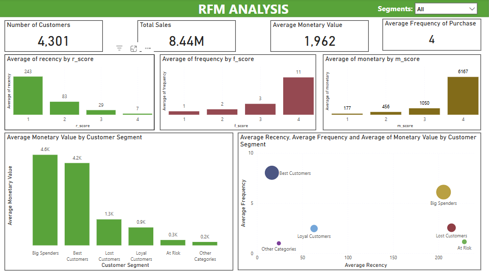
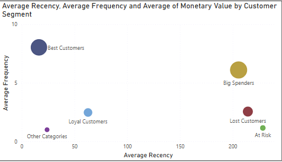

# Customer Segmentation - RFM Analysis

In this analysis, we’ve segmented customers into five distinct categories based on their Recency, Frequency, and Monetary (RFM) values. Let’s break down each segment:

**Best Customers** 🏆

- Criteria: Recency ≤ 2 days and FM Score ≥ 4.
- Description: These are the most valuable customers who have made recent purchases and have a high average Frequency and Monetary value. They buy often and spend significantly, making them the top priority for retention and engagement strategies.

**Loyal Customers** ❤️

- Criteria: Recency ≤ 3 days and FM Score ≥ 3.
- Description: These customers have a strong purchasing relationship with the business, buying frequently with moderate-to-high spending levels. They may not spend as much as the "Best Customers," but their consistency makes them important for long-term growth.

**Big Spenders** 💰

- Criteria: FM Score ≥ 4.
- Description: Customers in this segment have high monetary value, meaning they spend significantly but may not buy as often or recently. They are valuable from a revenue perspective, and encouraging more frequent purchases could convert them into "Best Customers."

**At Risk** ⚠️

- Criteria: Recency between 3 and 4 days, and FM Score ≤ 3.
- Description: These customers have not purchased in a while and have low-to-moderate Frequency and Monetary scores. They are at risk of disengagement, making them prime candidates for win-back or targeted marketing campaigns to bring them back into regular activity.

**Lost Customers** ❌

- Criteria: Recency ≥ 5 days.
- Description: These customers haven’t made a purchase for a significant amount of time and have low FM scores. They are considered inactive or disengaged, and re-engagement efforts may be necessary to prevent them from switching to competitors.

The bubble chart in the Power BI dashboard visually represents the different customer segments based on Recency, Frequency, and Monetary values. Here's a quick breakdown of the chart:

1. **X-Axis (Average Recency)**: Measures how recently the customers made their last purchase. Lower values indicate more recent purchases, and higher values mean it has been longer since the last purchase.

2. **Y-Axis (Average Frequency)**: Measures how often the customers make purchases. Higher values suggest more frequent purchases.

3. **Bubble Size**: Indicates the Monetary value (how much customers spend). Larger bubbles represent customers who spend more.

------
## Strategic Insights:
- **Best Customers and Big Spenders** represent high monetary value. These customers should be prioritized for retention efforts through
  1. **_personalized VIP/Loyalty Programs_**: Create exclusive offers or discounts for this group. Offer early access to new products or special promotions as a reward for their loyalty and spending.
  2. **_Personalized Communication_**: Send personalized thank-you emails or notes after each purchase to make them feel valued.
- **Loyal Customers** should be nurtured to encourage even higher spending or more frequent purchases.
- **At Risk and Lost Customers** require win-back strategies to bring them back into the fold, with special offers tailored to rekindle their interest.
- **Other Categories** might need a more generalized approach, such as promotions or seasonal offers, to encourage re-engagement.

## Big Opportunity Segments:
**Focus Priority:** The business should focus on **_"Best Customers" and "Big Spenders"_** first, because these groups offer immediate, high-value returns with the least effort.

**Why?** 

1. They are already loyal or high spenders, and with targeted offers, they can be driven to buy more frequently or at higher values. 
2. Retention costs less than acquisition, and these customers already know and trust the brand, which reduces the barrier to further engagement.

**Next Focus:** 
**"Loyal Customers"** offer high engagement but lower spending, so encouraging higher basket values here could yield additional gains with minimal effort.
